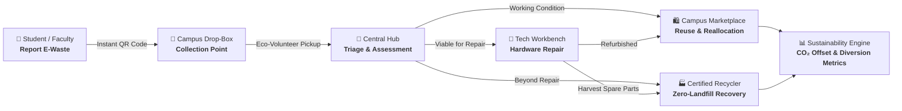

<div align="center">

# ♻️ EcoCycle Campus
### *Campus E-Waste Collection, Repair, Reuse & Zero-Landfill Recycling Platform*

[](https://nextjs.org/)
[](https://react.dev/)
[](https://www.typescriptlang.org/)
[](https://tailwindcss.com/)
[](https://expressjs.com/)
[](https://www.prisma.io/)
[](https://github.com/ShivamMishra2807/ecocycle-campus/actions)
[](LICENSE)

<br/>

**[🌐 Live Demo](https://shivammishra2807.github.io/ecocycle-campus/)** • **[⚡ Deploy on Vercel](https://vercel.com/new/clone?repository-url=https%3A%2F%2Fgithub.com%2FShivamMishra2807%2Fecocycle-campus&root-directory=apps%2Fweb)** • **[🚀 Deploy Backend on Render](https://render.com/deploy?repo=https://github.com/ShivamMishra2807/ecocycle-campus)** • **[📖 API Documentation](http://localhost:5000/api/docs)**

</div>

---

## 📖 Table of Contents

- [Overview](#-overview)
- [Circular Lifecycle Flow](#-circular-lifecycle-flow)
- [Key Features](#-key-features)
- [Role-Based Access & Demo Accounts](#-role-based-access--demo-accounts)
- [System Architecture & Monorepo Structure](#-system-architecture--monorepo-structure)
- [Tech Stack](#-tech-stack)
- [Quick Start & Local Development](#-quick-start--local-development)
- [Environment Configuration](#-environment-configuration)
- [API Endpoints Reference](#-api-endpoints-reference)
- [Deployment Guide](#-deployment-guide)
- [Contributing](#-contributing)
- [License](#-license)

---

## 🌿 Overview

**EcoCycle Campus** is a production-grade full-stack sustainability platform engineered specifically for university campuses and educational institutions. It digitizes and closes the loop on electrical and electronic equipment (EEE) waste, preventing hazardous hardware from entering landfills while redistributing functional refurbished devices to deserving students and research labs.

### The Circular Model:
$$\text{Report} \longrightarrow \text{Collect} \longrightarrow \text{Assess} \longrightarrow \text{Repair} \longrightarrow \text{Reuse} \longrightarrow \text{Recycle} \longrightarrow \text{Impact Analytics}$$

---

## 🔄 Circular Lifecycle Flow



---

## ✨ Key Features

### 1. 📋 5-Step Animated E-Waste Submission Wizard
- Dynamic device category selection (Laptops, Desktops, Mobiles, Tablets, Accessories, etc.).
- Multi-dimensional physical & functional condition triage.
- Automated drop-box location selector with live capacity load indicators.
- Instant client-side asset generation with scannable QR Code and unique Asset ID (`EC-XXX-XXXX`).

### 2. 🔍 Real-Time Device QR Lifecycle Tracking (`/device/:assetNumber`)
- End-to-end audit trail tracking each asset from physical drop-off to its final reuse or zero-landfill recycling.
- Displays responsible technician/volunteer, current campus workshop location, diagnosis history, and parts replaced.

### 3. 🛍️ Refurbished Device Reuse Marketplace
- Circular marketplace allowing students, labs, and student clubs to browse and claim certified refurbished laptops, monitors, and peripherals.
- One-click allocation request system with institutional approval workflows.

### 4. 👥 Role-Based Portals & Dashboards
- **Student Portal**: Track personal submissions, pickup statuses, and earned campus eco-credits.
- **Volunteer Console**: Real-time pickup routes, bin capacity meters, and single-tap collection confirmation.
- **Technician Workbench**: Active repair tickets, parts inventory deduction, diagnosis recording, and refurbishing checklists.
- **Admin Command Center**: Executive analytics with interactive Recharts (Lifecycle distribution donut, monthly diversion weight trends, category breakdown, and raw audit log CSV exporter).

### 5. 📜 Certified Zero-Landfill Recycling
- E-waste certificate manager documenting precious metal recovery (Gold, Copper, Palladium) and compliant hazardous waste disposal with government-registered recycling partners.

### 6. 📈 Campus Sustainability Impact Engine
- Live automated calculations for:
  - **Landfill Diversion Rate (%)**
  - **Repair Success Rate (%)**
  - **Reuse Reallocation Rate (%)**
  - **Net Carbon Offset ($\text{kg CO}_2\text{e}$)**

---

## 🔑 Role-Based Access & Demo Accounts

The platform includes pre-seeded accounts for testing all roles immediately:

| Role | Demo Email | Password | Primary Responsibilities |
| :--- | :--- | :--- | :--- |
| 🛡️ **Admin** | `admin@ecocycle.local` | `Admin@123` | Institutional analytics, audit logs, system-wide controls |
| 🔧 **Technician** | `technician@ecocycle.local` | `Tech@123` | Hardware triage, repair tickets, inventory & parts logging |
| 🚴 **Volunteer** | `volunteer@ecocycle.local` | `Vol@123` | Campus drop-box pickups, bin load balancing, dispatching |
| 🎓 **Student** | `student@ecocycle.local` | `Student@123` | Device submission, tracking, marketplace reuse claims |

> 💡 *Tip: You can also use the **Quick Demo Login Pill** located in the top navigation bar of the web app.*

---

## 🏗️ System Architecture & Monorepo Structure

```
ecocycle-campus/
├── apps/
│   ├── api/                     # Node.js + Express REST API Backend
│   │   ├── src/
│   │   │   ├── controllers/     # Device, E-waste, Auth, Analytics controllers
│   │   │   ├── middleware/      # JWT Authentication & Error handlers
│   │   │   ├── routes/          # REST route declarations
│   │   │   └── utils/           # QR code generation & response helpers
│   │   └── package.json
│   │
│   └── web/                     # Next.js 15+ App Router Frontend
│       ├── app/                 # React 19 pages & route handlers
│       │   ├── collection-points/ # Interactive campus bin map
│       │   ├── dashboard/       # Role-based dashboards (Admin, Tech, Volunteer)
│       │   ├── device/          # QR-based device lifecycle tracker
│       │   ├── marketplace/     # Refurbished reuse catalog
│       │   └── submit-ewaste/   # Multi-step submission wizard
│       ├── components/          # Reusable UI component library
│       ├── lib/                 # TanStack Query & API client helpers
│       └── package.json
│
├── packages/
│   ├── database/                # Prisma ORM & Database schema
│   │   ├── prisma/
│   │   │   ├── schema.prisma    # 17 normalized relational models
│   │   │   └── seed.ts          # Comprehensive initial database seeder
│   │   └── package.json
│   │
│   └── shared/                  # Shared TypeScript interfaces & Zod schemas
│       ├── src/
│       └── package.json
│
├── .github/
│   └── workflows/
│       ├── deploy.yml           # Automated CI/CD Monorepo verification
│       └── deploy-pages.yml     # Automated GitHub Pages frontend deployment
│
├── docker-compose.yml           # Multi-container local/production setup
└── package.json                 # Monorepo root workspace config
```

---

## 🛠 Tech Stack

| Domain | Technologies |
| :--- | :--- |
| **Frontend** | [Next.js 15](https://nextjs.org/) (App Router), [React 19](https://react.dev/), [TypeScript](https://www.typescriptlang.org/), [Tailwind CSS v4](https://tailwindcss.com/), [Framer Motion](https://www.framer.com/motion/), [Recharts](https://recharts.org/), [Lucide Icons](https://lucide.dev/), [TanStack Query](https://tanstack.com/query) |
| **Backend** | [Node.js](https://nodejs.org/), [Express.js](https://expressjs.com/), [TypeScript](https://www.typescriptlang.org/), [Zod](https://zod.dev/), [JWT Auth](https://jwt.io/), [bcryptjs](https://github.com/dcodeIO/bcrypt.js), [Helmet](https://helmetjs.github.io/), [CORS](https://github.com/expressjs/cors) |
| **Database & ORM** | [Prisma ORM](https://www.prisma.io/), [SQLite](https://sqlite.org/) (Development) / [PostgreSQL](https://www.postgresql.org/) (Production-ready) |
| **DevOps & CI/CD** | [GitHub Actions](https://github.com/features/actions), [GitHub Pages](https://pages.github.com/), [Docker Compose](https://docs.docker.com/compose/) |

---

## ⚡ Quick Start & Local Development

### Prerequisites
- **Node.js**: `v20.x` or higher
- **npm**: `v10.x` or higher

### 1. Clone the Repository
```bash
git clone https://github.com/ShivamMishra2807/ecocycle-campus.git
cd ecocycle-campus
```

### 2. Install Dependencies
```bash
npm install
```

### 3. Setup Environment Variables
```bash
cp .env.example .env
```

### 4. Build Shared Packages & Initialize Database
```bash
# Build shared TypeScript schemas
npm run build --workspace=packages/shared

# Generate Prisma Client, push schema and seed demo data
npm run db:generate
npm run db:push
npm run db:seed
```

### 5. Launch Development Servers
```bash
# Option A: Run Backend and Frontend in separate terminals
npm run dev:api    # REST API at http://localhost:5000
npm run dev:web    # Next.js Web App at http://localhost:3000

# Option B: Run via Docker Compose
docker-compose up --build
```

---

## 🔐 Environment Configuration

Create a `.env` file in the root directory (or use `.env.example`):

```env
# Database Connection (SQLite default, or PostgreSQL)
DATABASE_URL="file:./dev.db"

# JWT Authentication Secrets
JWT_SECRET="ecocycle-super-secret-jwt-key-2026-campus-auth"
JWT_REFRESH_SECRET="ecocycle-super-secret-refresh-key-2026-campus-auth"
JWT_EXPIRES_IN="7d"

# Server Ports & CORS
PORT=5000
CORS_ORIGIN="http://localhost:3000"
NEXT_PUBLIC_API_URL="http://localhost:5000/api/v1"

NODE_ENV="development"
```

---

## 📡 API Endpoints Reference

The backend REST API is documented interactively at `http://localhost:5000/api/docs`.

| Method | Endpoint | Description | Protected |
| :--- | :--- | :--- | :--- |
| `POST` | `/api/v1/auth/register` | Register new campus user | No |
| `POST` | `/api/v1/auth/login` | Authenticate & receive JWT tokens | No |
| `GET` | `/api/v1/devices` | Query devices with filters & search | Yes |
| `GET` | `/api/v1/devices/:assetNumber` | Fetch full lifecycle history for QR lookup | No |
| `POST` | `/api/v1/ewaste/submit` | Submit new e-waste item & get QR | Yes |
| `GET` | `/api/v1/collection-points` | List campus drop-off locations & loads | No |
| `GET` | `/api/v1/repairs/tickets` | Technician workbench active repair queue | Technician / Admin |
| `GET` | `/api/v1/marketplace/listings` | Fetch refurbished devices for reuse | No |
| `POST` | `/api/v1/marketplace/request` | Submit claim for refurbished hardware | Yes |
| `GET` | `/api/v1/analytics/overview` | Aggregated campus impact statistics | Admin / Public |

---

## 🚀 Deployment Guide

### Deploy Frontend on GitHub Pages
This repository is configured with automated GitHub Actions deployment:
1. Navigate to **Settings** ➔ **Pages** in your GitHub repository.
2. Under **Build and deployment** ➔ **Source**, select **`GitHub Actions`**.
3. Pushes to `main` automatically build and publish to `https://<your-username>.github.io/ecocycle-campus/`.

### Deploy on Vercel & Render
- **Frontend (Vercel)**: Import repository, set Root Directory to `apps/web`, and add environment variable `NEXT_PUBLIC_API_URL`.
- **Backend (Render / Railway / Fly.io)**: Import repository, set Root Directory to `apps/api`, and configure `DATABASE_URL` and `JWT_SECRET`.

---

## 🤝 Contributing

Contributions are welcome! To contribute:
1. Fork the Project (`gh repo fork ShivamMishra2807/ecocycle-campus`)
2. Create your Feature Branch (`git checkout -b feature/AmazingFeature`)
3. Commit your Changes (`git commit -m 'feat: add some amazing feature'`)
4. Push to the Branch (`git push origin feature/AmazingFeature`)
5. Open a Pull Request


